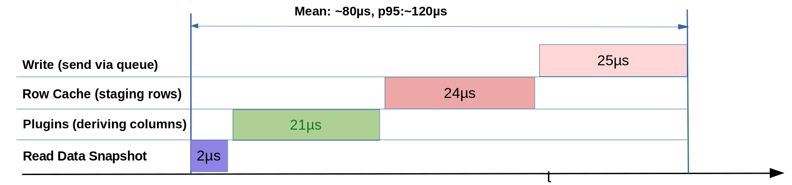

# Performance testing

`kiwi-scan` can optionally measure scan operation times and print a summary after the scan cleanup. 
Performance instrumentation and debug logging add extra load to the measured processes.
Normally, this overhead  can be ignored but must be considered for a sub-millisecond scan point pipeline (>1kHz samplerate).

## Enable performance reporting

Enable the option in the scan YAML file at top level:

```yaml
performance_report: true
```

Setting `debug: true` also enables the `PerformanceTracker`. Use an INFO or
less verbose logging level for representative throughput measurements; DEBUG
logging changes high-rate results.

## Reported measurements

Depending on the scan type, the report can include:

| Metric | Meaning |
|---|---|
| `daq:point` | Complete continuous point-processing block. |
| `read_detectors` | Detector read or atomic cache snapshot. |
| `update_row_cache` | Point-frame and cache construction. |
| `row_cache:detectors` | Detector value and metadata insertion. |
| `plugins` | Synchronous plugin processing time. |
| `write:data` | Point freeze and enqueue, not necessarily physical disk completion. |
| `monitor:update` | Live monitor publication (blocks scan task). |
| `sync:wait` | External synchronization or absolute timer wait. |
| `triggers:*` | Trigger processing phases (e.g. `on_point`). |
| `daq:run` | Complete DAQ loop. |

The report also prints non-timing diagnostics:

- Dropped meta-data queueed events.
- Largest observed number of queued scan points for data writer.
- Longest time a point waited before the writer processed it.


## kiwi-scan performance 

Kiwi Scan synchronized data acquisition via subscriptions has been tested at
1.2 kHz using the [feedback-core example IOC](https://github.com/hz-b/feedback-core)
and its [performance scan configuration](https://github.com/hz-b/feedback-core/blob/main/testIoc/iocBoot/iocfeedbackTest/performance.yaml).
Those test runs acquired 10,000 points without observed loss.  


## Example scan-loop hot-path performance tests

The hot processing path (core pipeline) snapshot reading, row caching, and writing remains fast as the number of PVs increases. 
These results are not hard real-time guarantees, as system load can affect latency and timing at high acquisition rates.



### Test configuration

Three configurations has been measured:
- 4 PVs with timestamps and [performance](https://github.com/hz-b/kiwi-scan/blob/master/docs/plugins.md#timestampperformanceplugin) plugin calculations, 18 data columns in total
- Simple data aquisition of 2000 PVs and with 30 PVs

| Stage | 4 PVs, 18 columns | 2,000 PVs | 30 PVs
|---|---:|---:|---:|
| Read data snapshot | 2 µs | 19 µs | 2 µs | 
| Plugins (derived columns) | 21 µs | - | - |
| Row cache (stage row) | 24 µs | 1.9 ms | 36 µs |
| Write (freeze and queue) | 25 µs | 1.5 ms | 44  µs |

Test system:

- Intel Core i5-13400, 16 GB RAM, Debian 12.15, Linux 6.1.180 (`PREEMPT_DYNAMIC`)
- CPU load measured using Debian `sysstat`: less than 1%
