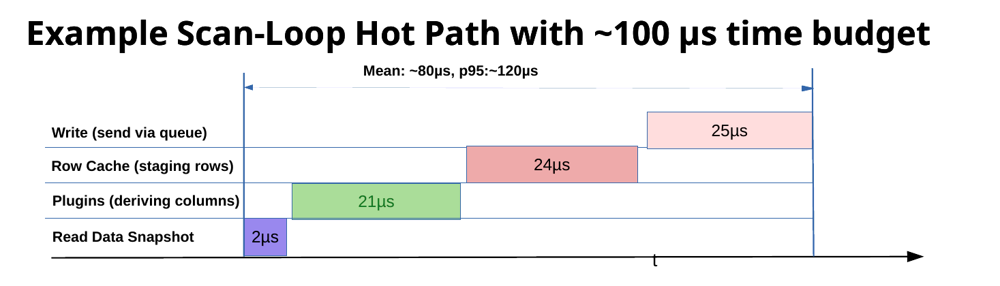

# Performance testing

`kiwi-scan` can optionally measure scan operation times and print a summary after the scan cleanup. 
Performance instrumentation and debug logging add extra load to the measured processes.
Normally, this overhead  can be ignored but must be considered for a sub-millisecond scan point pipeline (>1kHz samplerate).

## Enable performance reporting

Enable the option in the scan YAML file at top level:

```yaml
performance_report: true
```

Setting `debug: true` also enables the `PerformanceTracker`. Use an INFO or
less verbose logging level for representative throughput measurements; DEBUG
logging changes high-rate results.

## Reported measurements

Depending on the scan type, the report can include:

| Metric | Meaning |
|---|---|
| `daq:point` | Complete continuous point-processing block. |
| `read_detectors` | Detector read or atomic cache snapshot. |
| `update_row_cache` | Point-frame and cache construction. |
| `row_cache:detectors` | Detector value and metadata insertion. |
| `plugins` | Synchronous plugin processing time. |
| `write:data` | Point freeze and enqueue, not necessarily physical disk completion. |
| `monitor:update` | Live monitor publication (blocks scan task). |
| `sync:wait` | External synchronization or absolute timer wait. |
| `triggers:*` | Trigger processing phases (e.g. `on_point`). |
| `daq:run` | Complete DAQ loop. |

The report also prints non-timing diagnostics:

- Dropped meta-data queueed events.
- Largest observed number of queued scan points for data writer.
- Longest time a point waited before the writer processed it.


## kiwi-scan performance 

Kiwi Scan synchronized data acquisition via subscriptions has been tested at
1.2 kHz using the [feedback-core example IOC](https://github.com/hz-b/feedback-core)
and its [performance scan configuration](https://github.com/hz-b/feedback-core/blob/main/testIoc/iocBoot/iocfeedbackTest/performance.yaml).
Those test runs acquired 10,000 points without observed loss.  

## Example scan-loop hot path

The figure shows the per-point hot path of a synchronous scan loop with a
time budget of about 100 µs per point (about 10 kHz). The complete point
takes about 80 µs on average, with a p95 of about 120 µs.



| Stage | Report metric | 4 PVs, 18 columns | 2000 PVs |
|---|---|---|---|
| Read data snapshot | `read_detectors` | 2 µs | 19 µs |
| Plugins (deriving columns) | `plugins` | 21 µs | – |
| Row cache (staging rows) | `update_row_cache` | 24 µs | 1.9 ms |
| Write (freeze and enqueue) | `write:data` | 25 µs | 1.5 ms |

The write stage only freezes the point and submits it to the writer queue.
Formatting and the disk write run in the writer thread, outside the hot path
(see [point-pipeline.md](point-pipeline.md#file-io)).

Test conditions:

- Intel i5-13400, 16 GB RAM, Debian 12.15, Linux 6.1.180 (`PREEMPT_DYNAMIC`)
- CPU load below 1 %
- 4 PVs with timestamps and plugin calculations, 18 data columns in total

The core pipeline (snapshot, row cache and write, without plugins) stays fast
at scale. It handles about 30 PVs within the 100 µs budget.
